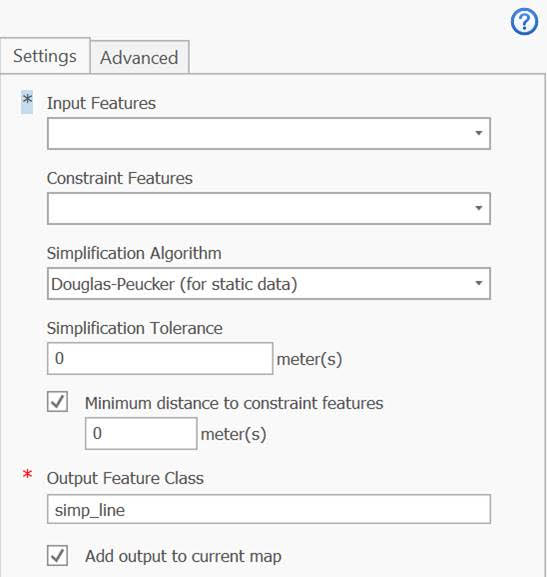
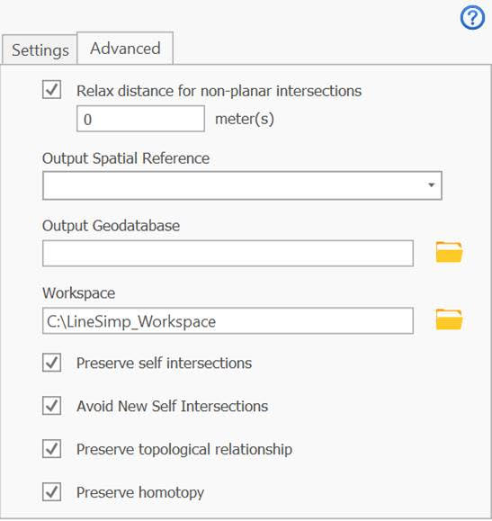
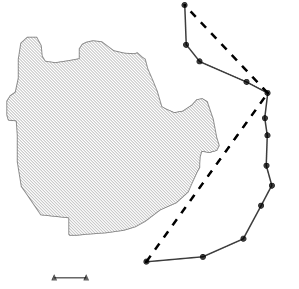
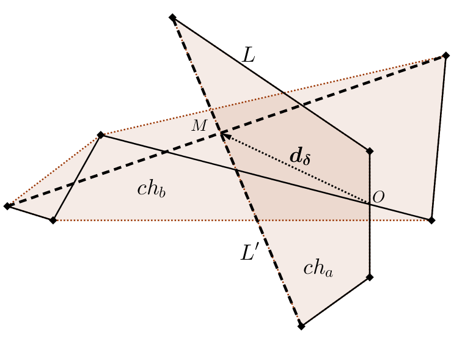
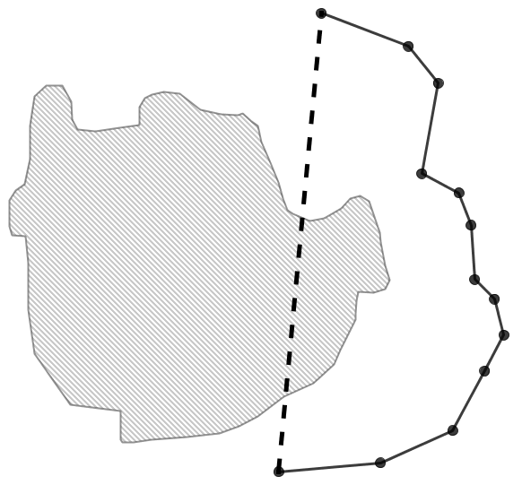
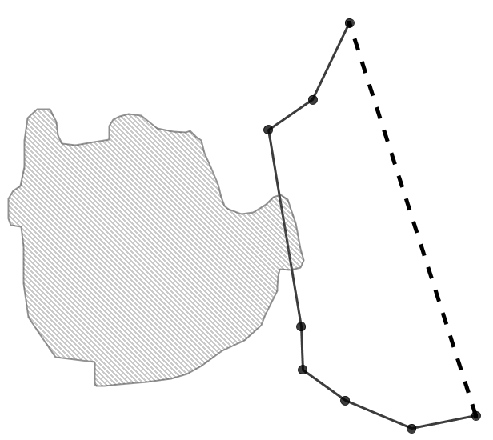
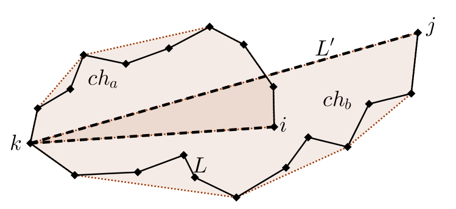

# Introduction 

For many applications in spatial and spatio-temporal GIS, it is beneficial 
to collect data once the highest possible resolution as a master database. 
Simplification can be used as a tool to derive data at a coarser resolution 
from the master database for other applications.  Simplification can also be 
used  as a pre-processing tool before data mining, visualization, data 
transmission, and data exploration.

Line simplification is the process of deforming the shape of a geometry by 
removing excessive detail. There are two methods
 - Line smoothing (curve fitting) 
 - Vertex reduction

Either method, based on some criteria, may produce a simplification that has 
much less detail compared to the original polyline. If topologically constrained, 
the simplification will result in an output that maintains some topological 
consistency with the original input.

Unconstrained simplification can lead to various topological errors in the output 
geometry. In circumstances where the input geometry has spatial relationships with 
other features in the same layer or other layers, the spatial context under which 
the linear feature to be simplified needs consideration. 
Out of context simplification can lead to change in contextual representation and 
meaning - simplified geometry may be self topologically consistent but spatially 
invalid relative to other features that constrain its shape. 

The goal of this plugin is to support contextual simplification linear features
and spatio-temporal trajectories. 

# Input parameters 
All input and constraint features are expected to be in the same projected coordinate system.
The figure bellow shows the basic input interface of the plugin.  

Advance settings are provided in the next tab: 

## Linear Feature Class
In [Douglas-Peucker simplification](dp), linear features in the input feature class are 
expected to be `X,Y` coordinates. In a spatio-temporal simplification, input features 
should be `X,Y,Z` or `X,Y,M`, where `Z` or `M` component represents time. 
Spatio-temporal simplification uses synchronised euclidean distance algorithm 
([SED](http://bit.ly/2xTRcVs)).

## Input Constraints Feature Class
The optional constraints layer can be points, lines or polygons geometries. 
This layer should be in the same projection as the input linear layer.

# Feature Class - Planar and Non-planar intersections
Linear features in the same feature layer can serve as constraints to each other. 
For example, contour lines have the inherent constraint of not crossing each other. 
A road network features may have planar intersects like junctions and non-planar 
intersects like an overpass.
These internal overlaps can be preserved by checking the box to preserve spatial 
relationships in the same linear feature.
In spatio-temporal trajectories, depending on the type of data, linear features may 
overlap in space but are separated in time, the spatial relations between unique 
trajectories might not be relevant.

## Simplification Threshold 
Simplification threshold is a distance at which the shape or spatio-temporal characteristics 
of a linear geometry is relevant to keep a vertex during simplification ([process of vertex reduction](https://pro.arcgis.com/en/pro-app/latest/tool-reference/cartography/simplify-line.htm))

## Relax Distance
In the case of a non-planar overlap, a relaxation distance of how much the simplification 
overlap should displace from the original can be provided.

## Avoid Self Intersection 
Avoid self intersection prevents introducing new self-interactions as a result of simplification.

## Geometric Relation
If checked (set to true) will preserve the overlay spatial relations between input linear features 
and simplification - intersect and disjoint relations

  

  

## Distance Relation 
A minimum distance threshold is used to maintain a certain proximity to constraint objects.
When this minimum distance is not observed by the input polyline, then the simplified geometry will use the
proximity of the input geometry to a constraint object.

## Side Relation 
Side relation maintains sidedness of constraint objects to the simplified polyline.

[dp]: https://en.wikipedia.org/wiki/Ramer%E2%80%93Douglas%E2%80%93Peucker_algorithm