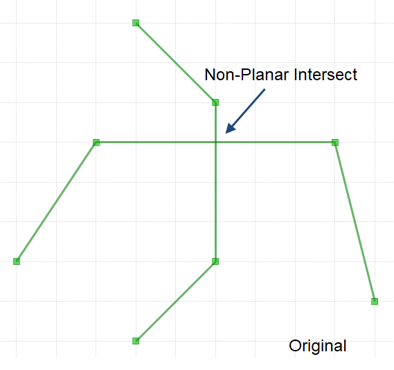
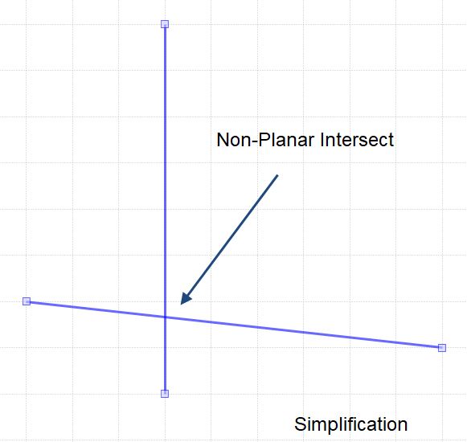
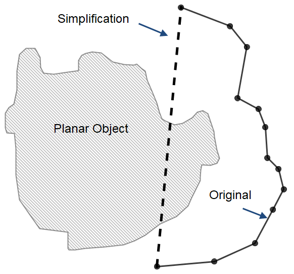

# Simplification Tool
This tool is designed to perform line simplification in the context of other planar objects.
The simplification is constrained by various options and planar objects. 
Simplification of arbitrary polylines in the context of arbitrary planar geometries are supported.


# Table of contents

<!--ts-->
   * [Introduction](#Introduction)
   * [Geometry Types](#Geometry-Types)
      * [Point Features](#Point-Type)
      * [Linear Features](#Linear-Type)
        * [Spatiotemporal Coordinates](#Spatiotemporal-Coordinates)
      * [Polygon Features](#Polygon-Type)
   * [How to build from source](#How-to-build-from-source)
   * [How to use](#How-to-use)
     * [Simplification Options](#Simplification-Options)
       * [Sample JSON configuration](#Sample-JSON-configuration)
       * [input](#input)
       * [output](#output)
       * [constraints](#constraints)
       * [simplification_type](#simplification_type)
       * [threshold](#threshold)
       * [minimum_distance](#minimum_distance)
       * [non_planar_displacement](#non_planar_displacement)
       * [is_feature_class](#is_feature_class)
       * [planar_self](#planar_self)
       * [non_planar_self](#non_planar_self)
       * [avoid_new_self_intersects](#avoid_new_self_intersects)
       * [geometric_relation](#geometric_relation)
       * [distance_relation](#distance_relation)
       * [homotopy_relation](#homotopy_relation)
   * [GeoJSON to Base 64](#GeoJSON-to-Base-64)
     * [In C-Sharp](#In C-Sharp)
     * [In Python 3](#In-python-3)  
<!--te-->


# Introduction
For many applications in spatial and spatio-temporal GIS, it is beneficial 
to collect data once the highest possible resolution as a master database. 
Simplification can be used as a tool to derive data at a coarser resolution 
from the master database for other applications.  Simplification can also be 
used  as a pre-processing tool before data mining, visualization, data 
transmission, and data exploration.

Line simplification is the process of deforming the shape of a geometry by 
removing excessive detail. There are two methods:
 - Line smoothing (curve fitting) 
 - Vertex reduction

Either method, based on some criteria, may produce a simplification that has 
much less detail compared to the original polyline. If topologically constrained, 
the simplification will result in an output that maintains some topological 
consistency with the original input.

Unconstrained simplification can lead to various topological errors in the output 
geometry. In circumstances where the input geometry has spatial relationships with 
other features in the same layer or other layers, the spatial context under which 
the linear feature to be simplified needs consideration. 
Out of context simplification can lead to change in contextual representation and 
meaning - simplified geometry may be self topologically consistent but spatially 
invalid relative to other features that constrain its shape. 

The goal of this plugin is to support contextual simplification of linear features
and spatio-temporal trajectories. 

## Geometry Types
This simplification tool accepts single line [GeoJSON](https://geojson.org/) features (single/multi) or their
geometries either as input linear features or constraints (points, lines, and polygons).


### Point Type 
Here is an example of a point feature (in multiple lines for clarity): 
```json
{
  "type": "Feature",
  "geometry": {
    "type": "Point",
    "coordinates": [125.6, 10.1]
  },
  "properties": {
    "name": "Titus Islands"
  }
}
```

A point GeoJSON string as input should be on one line, like this: 

```json
{"type": "Feature", "geometry": {"type": "Point", "coordinates": [125.6, 10.1]}, "properties": {"name": "Titus Islands"}}
```

or only the geometry part of the GeoJSON: 

```json
{"type": "Point", "coordinates": [125.6, 10.1]}
```

Multipoint versions of feature/geometry are supported 

```json
{"type": "MultiPoint", "coordinates": [[10.0, 40.0], [40.0, 30.0], [20.0, 20.0], [30.0, 10.0]]}
```

### Linear Type
Here is an example of a linear feature: 
```json
{
      "type": "Feature",
      "geometry": {
        "type": "LineString",
        "coordinates": [
          [102.0, 0.0], [103.0, 1.0], [104.0, 0.0], [105.0, 1.0]
        ]
      },
      "properties": {
        "prop0": "value-0",
        "prop1": 0
      }
}
```
simplification tool expects: 
```json
{"type": "Feature", "geometry": {"type": "LineString", "coordinates": [[102.0, 0.0], [103.0, 1.0], [104.0, 0.0], [105.0, 1.0]]}, "properties": {"prop0": "value0", "prop1": 0.0}}
```
or just the geometry 
```json
{"type": "LineString", "coordinates": [[30.0, 10.0], [10.0, 30.0], [40.0, 40.0]]}
```

A `MultiLineString` feature will look like this : 
```json
{
      "type": "Feature",
      "geometry": {
         "type": "MultiLineString", 
         "coordinates": [
             [[10.0, 10.0], [20.0, 20.0], [10.0, 40.0]], 
             [[40.0, 40.0], [30.0, 30.0], [40.0, 20.0], [30.0, 10.0]]
         ]
      },
      "properties": {
        "prop0": "value-0",
        "prop1": 0
      }
}
```
as input, string should be a single line: 
```json
{"type": "Feature", "geometry": {"type": "MultiLineString", "coordinates": [[[10.0, 10.0], [20.0, 20.0], [10.0, 40.0]], [[40.0, 40.0], [30.0, 30.0], [40.0, 20.0], [30.0, 10.0]]]}, "properties": {"prop0": "value0", "prop1": 0.0}}
```
or just the geometry:
```json
{"type": "MultiLineString", "coordinates": [[[10.0, 10.0], [20.0, 20.0], [10.0, 40.0]], [[40.0, 40.0], [30.0, 30.0], [40.0, 20.0], [30.0, 10.0]]]}
```

#### Spatiotemporal Coordinates
When performing simplification of `3D` linear features, for example trajectories, the coordinates of each vertex
can have a third component such as time: `[2819444.40306664, 4502116.1380905, 1370045820.0]`. `3D` coordinates 
are required when performing Synchronized Euclidean Distance (`SED`) simplification.
A snippet of a `3D` linestring:  
```text
{"type": "Feature", "geometry": {"type": "LineString", "coordinates": [[2819444.40306664, 4502116.1380905, 1370045820.0], [2819445.51626154, 4502116.1380905, 1370047080.0],....]}}
```

### Polygon Type
Here is an example of a polygon feature: 

```json
{
      "type": "Feature",
      "geometry": {
         "type": "Polygon", 
         "coordinates": [
             [[30.0, 10.0], [40.0, 40.0], [20.0, 40.0], [10.0, 20.0], [30.0, 10.0]]
         ]
      },
      "properties": {
        "prop0": "value-0",
        "prop1": 0
      }
}
```
or just th polygon geometry: 

```json
{
    "type": "Polygon", 
    "coordinates": [
        [[30.0, 10.0], [40.0, 40.0], [20.0, 40.0], [10.0, 20.0], [30.0, 10.0]]
    ]
}
```

Tool expects data to be single line strings, like this: 
```json
{"type": "Polygon", "coordinates": [[[30.0, 10.0], [40.0, 40.0], [20.0, 40.0], [10.0, 20.0], [30.0, 10.0]]]}
```

`MultiPolygon` features or geometries are also supported.


### How to build from source

Install the latest version of [Go](https://golang.org/dl/)
Clone the repository, open a terminal/command prompt, change director (cd) to the cloned directory. Enter the command:

```shell
go build -o simplify.exe
```

### How to use

To perform a contextual simplification, a simplification configuration is need. A configuration is a
`JSON` string containing multiple simplification options. `simplify`[.exe] requires a configuration json in a text file
or a base64 encoded string passed at the command line.

Use the command line option `-b` for

```bash
./simplify.exe -b ewogICAgICAgICAgImlucHV0IiAgICAgICAgICAgICAgICAgICAgIDogImRhdGEvZm...
```

Use the command line option `-f` for configuration in a file

```bash
./simplify.exe -f "c:/path/to/config.json"
```

### Simplification Options

Simplification options are a set of key value pairs in a `JSON`

#### Sample JSON configuration

```json
{
  "input": "data/input.json",
  "output": "output/output.json",
  "constraints": "data/constraints.json",
  "simplification_type": "DP",
  "threshold": 50.0,
  "minimum_distance": 20.0,
  "non_planar_displacement": 10.0,
  "is_feature_class": false,
  "planar_self": true,
  "non_planar_self": true,
  "avoid_new_self_intersects": true,
  "geometric_relation": true,
  "distance_relation": true,
  "homotopy_relation": true
}
```

#### input

GeoJSON file with newline delimited strings (each line is linestring geojson feature) of JSON features (`LineString`
or `MultiLineString`).
For example, see [feature_class.json](example/data/feature_class.wkt).

```text
"input" : "data/input.json"
```

#### output

Path to simplification output as newline delimited simplification of `input`

```text 
"output" : "output/output.json"
```

#### constraints

GeoJSON file with newline delimited GeoJSON `Point`/`MultiPoint`, `LineString`/`MultiLineString` or 
`Polygon`/`MultiPolygon` geometries (feature or geometry). For example [constraints](example/data/constraints.json).

```text
"constraints" : "data/constraints.json" 
```

#### simplification_type

Type of simplification: Douglas-Peucker (`"DP"`) or Synchronized Euclidean Distance(`"SED"`)

```text
"simplification_type" : "DP"
```

#### threshold

Simplification distance threshold - this should be in same units as input planar coordinates

```text
"threshold" : 50.0
```

#### minimum_distance

Minimum distance from planar constraints - provide a value if `"distance_relation": true`. This 
distance is also in the same units as input coordinates.

```text
"minimum_distance" : 3.0
```

#### non_planar_displacement

Non planar displacement distance for non-planar intersections - provide value if `non_planar_self = true`.
The following figures illustrate the displacement of non planar overlap as a result of simplification. 
`non_planar_displacement` is a distance to constrain such displacements


<p float="left">
    
    
    
</p>

```text
"non_planar_displacement" : 10.0
```

#### is_feature_class

A collection of polylines can be independent or share a topological relation like contours or road network.
If `false` planar and non-planar intersections between polylines are not observed. 
If set to `true`, the relations between each feature in the class of linestrings are preserved based on options provided.

```text
"is_feature_class" : false
```

#### planar_self

Observe planar self-intersection - preserves planar intersection (vertex with degree greater than 2).
If `is_feature_class`
preserves planar intersections between features of a feature class.

Here are snippets of planar intersection and its simplification:

<p float="left">
    
    
    
</p>


```text
"planar_self" : false
```

#### non_planar_self

Observe non-planar self-intersection - preserves non-planar intersection (overlaps between lines that do not introduce
an intersection). If `is_feature_class`, preserves non-planar intersections between features of a feature class based on
a non-planar displacement value (`non_planar_displacement`).

```text
"non_planar_self" : false
```

#### avoid_new_self_intersects

Avoid introducing new self-intersections as a result of simplification algorithm.

```text
"avoid_new_self_intersects" : false
```

#### geometric_relation

Observe geometric relation (intersect / disjoint) to planar objects serving as constraints.

```text
"geometric_relation" : false
```
Out of context simplification can change the topology of the simplified polyline by introducing
an intersection (when features should be disjoint) or remove intersect intersection relation (when features should intersect)
See these examples:  
<p float="left">
    
    
</p>

#### distance_relation

Observe distance relation (minimum distance) to planar objects serving as constraints.

```text
distance_relation : false
```
Simplification may result in an output that is too close to planar constraints. In some
domains, trajectories may have a distance relation
to polygonal zones due to environmental restrictions such noise, pollution etc. The simplified
geometries can be constrained to observe some minimum distance relation to planar objects.
See illustration : 
<p float="left">
    
</p>

#### homotopy_relation

Observe homotopic (sidedness) relation to planar objects serving as constraints.

```text
"homotopy_relation" : false
```
Out of context simplification cn change the side relation to planar objects.
This constraint, if set to `true`, restricts the sidedness of the simplified polyline
to consistent as the original input.
The following illustrates change in homotopy due to simplification: 

<p float="left">
    
    
    
</p>


# GeoJSON to Base 64
The following snippets show how to convert configuration JSON to encoded 
base 64 string as a command line argument.

## In C-Sharp
Encode and decode string:
```c# 
public static string Base64Encode(string plainText) {
  var plainTextBytes = System.Text.Encoding.UTF8.GetBytes(plainText);
  return System.Convert.ToBase64String(plainTextBytes);
}

public static string Base64Decode(string base64EncodedData) {
  var base64EncodedBytes = System.Convert.FromBase64String(base64EncodedData);
  return System.Text.Encoding.UTF8.GetString(base64EncodedBytes);
}
```

## In Python 3 
Encode and decode string 

```python
import base64

def encode_base64(input_str):
    return base64.b64encode(input_str.encode("ascii")).decode("ascii")


def decode_base64(base64_str):
    return base64.b64decode(base64_str.encode("ascii")).decode("ascii")
```
